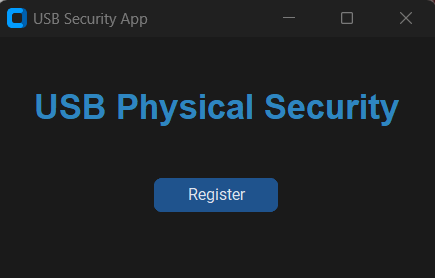
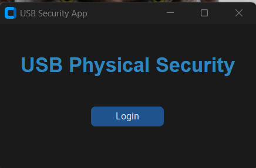
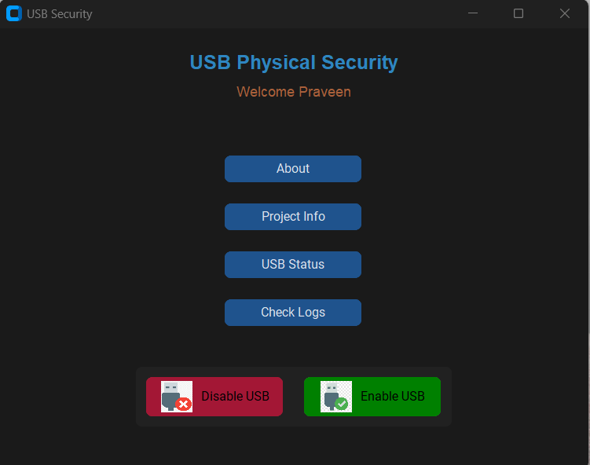

# USB Physical Security App

A secure desktop application that enables or disables USB ports based on user authentication and email verification. Built with Python, CustomTkinter, and batch scripts for system-level control.

---

## Features

- **One-time registration** with email and CAPTCHA
- **OTP verification** for enabling/disabling USB ports
- **Log management** with search, export, and secure delete
- **Encrypted SMTP configuration** for secure and automated email delivery
- GUI built entirely with **CustomTkinter**
- Intruder Detection with webcam

---

## Project Structure

```
├── main.py                 # Main app logic
├── disable_usb.bat         # Disables USB ports (windows registry editor tweak)
├── enable_usb.bat          # Enables USB ports  (windows registry editor tweak)
├── launch.bat              # Runs the application
├── about_app.html          # About the buttons and other questions regarding application (Opens in default web-browser)
├── project_info.html       # Developer and Organization details (Opens in default web-browser)
├── smtp_encrypt.py         # Encrypts SMTP config
├── other_process.py        # Base64 image processing and converting image to .ico file
├── requirements.txt        # Python dependencies
├── .gitignore              # Files ignored in version control
├── README.md               # This file
```

---

## How to Run the App

### 1️. Clone the Repo
```bash
git clone https://github.com/RavenRT02/usb-security-app.git
cd usb-security-app
```

### 2️. Create and Activate Virtual Environment
```bash
python -m venv venv
.venv\Scripts\activate   # On Windows
```

### 3️. Install Dependencies
```bash
pip install -r requirements.txt
```

### 4️. Configure SMTP (Secure Email Sending)

1. Create a `smtp.json` file like this:

```json
{
  "email": "your-email@example.com",
  "password": "your-app-password",
  "smtp_server": "smtp.gmail.com",
  "port": 587
}
```

2. Run the encryption tool:
```bash
python smtp_encrypt.py
```

3. This creates:
- `smtp.enc`: Encrypted credentials
- `smtp.key`: Key used for encryption

---

### 5. Packing for Distribution (pyinstaller)

---
## Packaging the App into an EXE (Optional)

To generate a standalone Windows executable using **PyInstaller**, follow these steps:

### 1️⃣ Install PyInstaller (one-time setup):
```bash
pip install pyinstaller

pyinstaller main.py --noconfirm --onefile --windowed --icon=icon/app.ico --name "USB Security App"
```
icon file is not included in the repository 

## Screenshots






---

## Disclaimer

This app modifies Windows registry settings. Use at your own risk and with proper permissions. Always test on non-critical machines first. This application requires adminstrator access to make changes to the USB port status.
